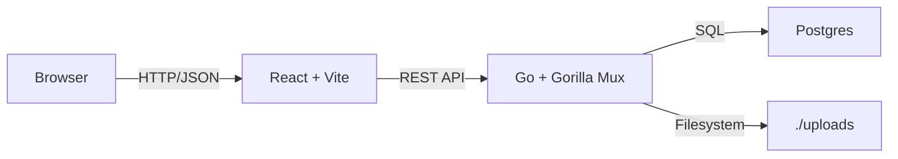

[Back to Home Page](../README.md)

# Architecture & Design — FileVault

## Overview

FileVault is a secure file-storage web application built with a **React (Vite)** frontend, a **Go (Gorilla Mux)** backend API, and a **PostgreSQL** database.
It supports user registration, login, file upload/download, deduplication (via content hash), privacy toggling, quotas, and admin features.
The entire stack runs in **Docker Compose** for easy local development.

## Goals

- Prevent duplicate storage of identical files.
- Enforce per-user upload quotas.
- Allow public sharing while maintaining secure access.
- Provide simple deployment with minimal dependencies.

## Components

| Layer                       | Tech/Service                 | Responsibilities                                                                      |
| --------------------------- | ---------------------------- | ------------------------------------------------------------------------------------- |
| **Frontend**                | React 19 + Vite + TypeScript | User interface, file uploads (via API), routing (react-router-dom).                   |
| **Backend**                 | Go + Gorilla Mux             | REST API, authentication, authorization, rate limiting, deduplication, file handling. |
| **Database**                | PostgreSQL 15                | Users, file metadata, reference counts, audit fields.                                 |
| **Storage**                 | Local `./uploads` folder     | Physical file objects (deduplicated by hash).                                         |
| **Container orchestration** | Docker Compose               | Runs db, backend, frontend in isolated services.                                      |

## High-level diagram



## Key flows

### Upload & Deduplication

1. Client POSTs to `/api/upload` with the file.
2. Backend streams the file, computes SHA-256 hash.
3. If a file with the same hash exists, increase `reference_count` in `files` table and skip writing a new object.
4. Otherwise, save the file to `./uploads/<hash>` and insert a new DB row.

### Authentication

- Sign-up: `POST /api/signup`
- Login: `POST /api/login` → JWT issued (secret: `JWT_KEY` from env).
- Protected routes use `AuthMiddleware` with JWT validation.

### Rate Limiting

- `RateLimitMiddleware` caps API requests per user (default `API_RATE_LIMIT` from env).

### Database Schema (summary)

Key tables (from migrations):

- **users**

  - `id`, `username`, `email`, `password`, `role` (user/admin)
  - `last_login`, `profile_picture`, `is_active`

- **files**

  - `id`, `filename`, `filepath`, `hash`, `size`
  - `reference_count`, `is_master`, `is_public`, `download_count`, `description`

All migrations are in `backend/internal/db/migrations/`.

### Deployment

- `docker-compose.yml` spins up:

  - `db` (Postgres 15) with mounted migrations.
  - `backend` (Go API) exposed on **8080**.
  - `frontend` (Vite dev server) exposed on **5173**.

Environment variables (example):

```
JWT_KEY=rachit_joshi
PORT=8080
USER_QUOTA_MB=10
API_RATE_LIMIT=10
DB_URL=postgres://filevault_db:filevault_db@db:5432/filevault?sslmode=disable
```

### Security

- Passwords stored with bcrypt.
- JWT-based auth.
- CORS enabled for frontend.
- SoftAuth middleware allows optional user context on public endpoints.

### Future Improvements

- Move storage to S3 or another object store for scalability.
- Add virus scanning and signed URLs.
- Chunked uploads for very large files.

---
